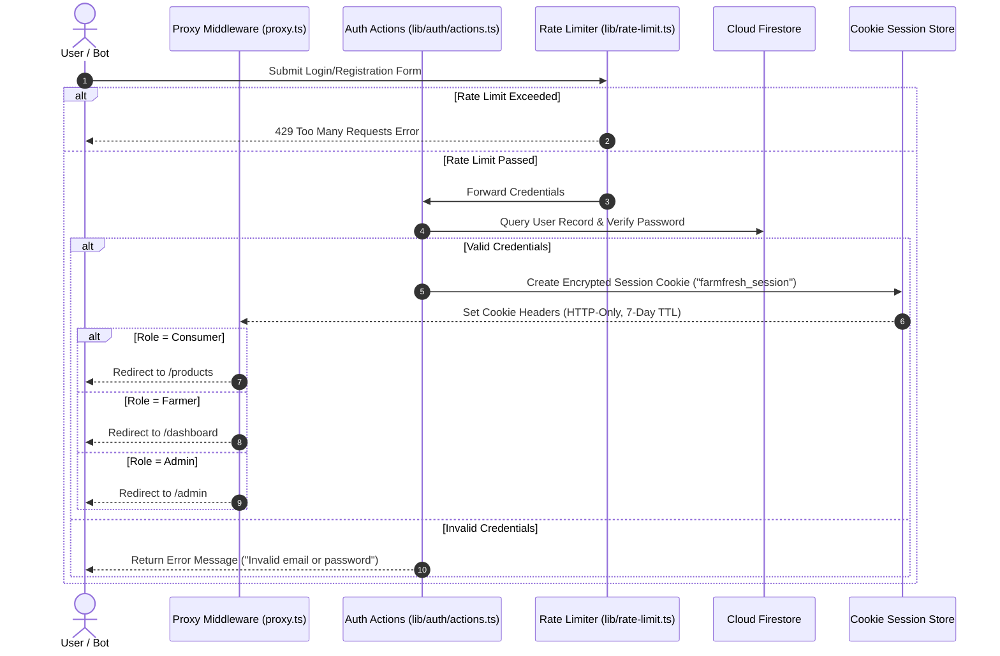
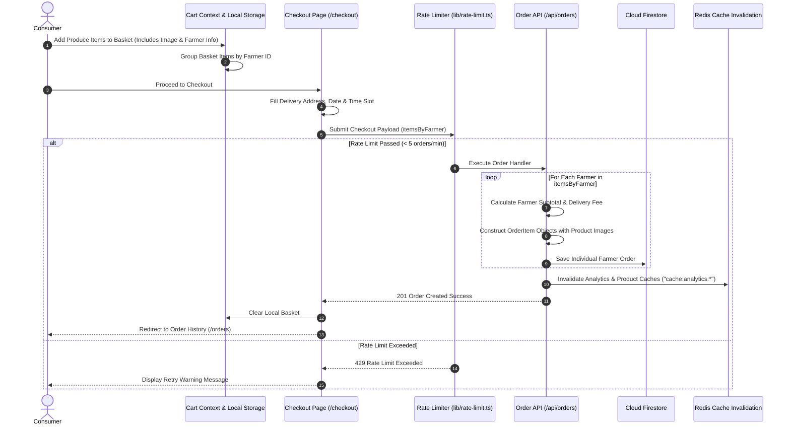
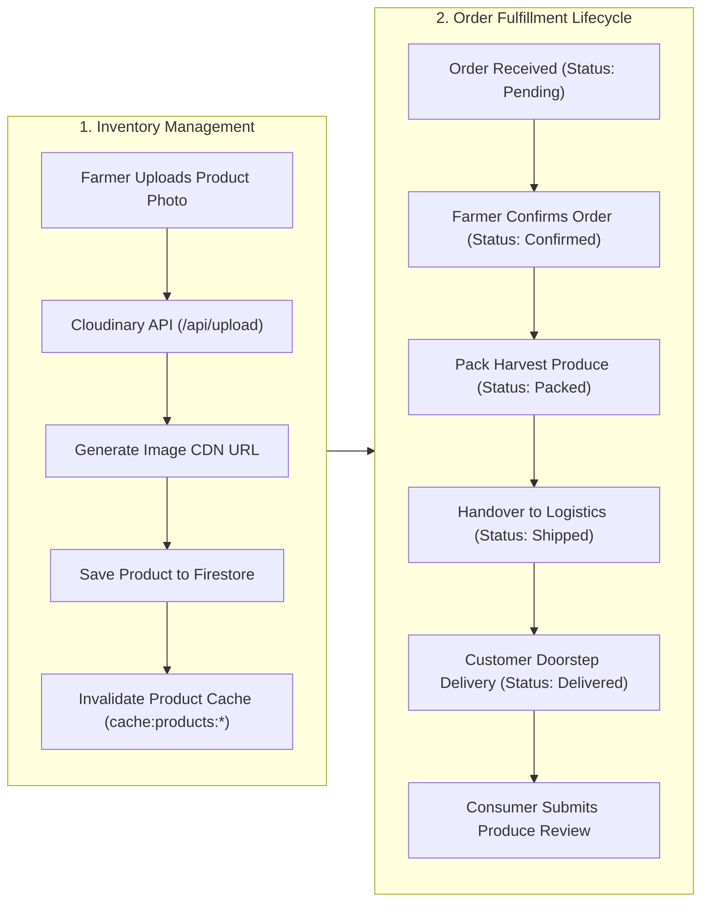
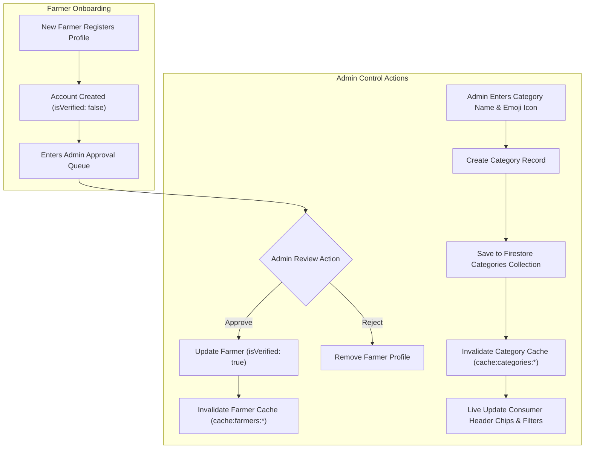

# FarmFresh — Workflow System Diagram & Architecture Design

This document details the system architecture, component relationships, security layers, and data workflows powering **FarmFresh Direct Agricultural Marketplace**.

---

## 1. High-Level System Architecture Diagram

```mermaid
flowchart TB
    subgraph CLIENT["Client Layer (Browsers & Devices)"]
        ConsumerUI["Consumer Web Application<br/>(/products, /cart, /checkout, /orders)"]
        FarmerUI["Farmer Operations Dashboard<br/>(/dashboard/*)"]
        AdminUI["Admin Portal<br/>(/admin/*)"]
    end

    subgraph MIDDLEWARE["Next.js 16 Edge & Proxy Layer"]
        ProxyMiddleware["Proxy Middleware (proxy.ts)<br/>Cookie Verification & Role-Based Access Control"]
    end

    subgraph SECURITY["Security & Bot Prevention Layer"]
        RateLimiter["Rate Limiting Engine (lib/rate-limit.ts)<br/>Tier 1: Redis Counters<br/>Tier 2: In-Memory Sliding Window"]
    end

    subgraph BACKEND["Next.js 16 App Router & Server Services"]
        AuthService["Auth Actions & Session Service<br/>(lib/auth/actions.ts, session.ts)"]
        OrderAPI["Order Processing API<br/>(/api/orders/route.ts)"]
        UploadAPI["Cloudinary Upload API<br/>(/api/upload/route.ts)"]
        ProductActions["Product Catalog Actions<br/>(app/dashboard/products/actions.ts)"]
        CategoryActions["Category Management Actions<br/>(app/admin/categories/actions.ts)"]
    end

    subgraph DATA["Data & Storage Infrastructure"]
        Firestore[("Cloud Firestore Database<br/>Users, Farmers, Products, Orders, Reviews, Categories")]
        Cloudinary[("Cloudinary Media API<br/>Farm Logos, Produce Photos, Hero Banners")]
        RedisCache[("Redis Caching Store<br/>(cache:products, cache:farmers, cache:analytics)")]
    end

    ConsumerUI --> ProxyMiddleware
    FarmerUI --> ProxyMiddleware
    AdminUI --> ProxyMiddleware

    ProxyMiddleware --> RateLimiter
    RateLimiter -->|Pass| BACKEND
    RateLimiter -.->|Limit Exceeded (429)| CLIENT

    AuthService --> Firestore
    OrderAPI --> Firestore
    ProductActions --> Firestore
    CategoryActions --> Firestore

    UploadAPI --> Cloudinary

    BACKEND <--> RedisCache
```

---

## 2. Authentication & Role-Based Routing Workflow



---

## 3. Produce Purchasing & Multi-Farmer Order Checkout Flow



---

## 4. Farmer Product Inventory & Order Fulfillment Workflow



---

## 5. Admin Verification & Category Taxonomy Flow



---

## 6. Subsystem Integration Matrix

| Subsystem | Primary Responsible File | Storage / Engine | Security Mechanism |
| :--- | :--- | :--- | :--- |
| **Authentication** | `lib/auth/actions.ts` | Session Cookie + Firestore | Rate limited (5 attempts/min) + HTTP-Only Cookies |
| **Route Security** | `proxy.ts` | Next.js 16 Edge Middleware | Cookie verification & RBAC redirection |
| **Rate Limiter** | `lib/rate-limit.ts` | Redis INCR + In-Memory Fallback | Max window counters + 429 Headers |
| **Order Processing** | `app/api/orders/route.ts` | Cloud Firestore Orders Collection | Rate limited (5 orders/min) + Cart splitting |
| **Media Uploads** | `app/api/upload/route.ts` | Cloudinary API | Rate limited (10 uploads/min) + Signed/Unsigned API |
| **Produce Caching** | `lib/data/products.ts` | Redis (`ioredis`) | Automated pattern invalidation (`cache:products:*`) |
